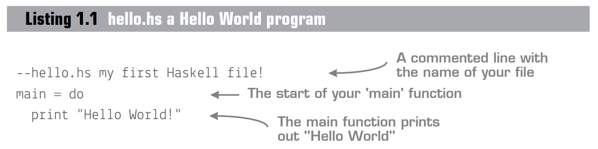

# Haskell 上手(Get Programming With Haskell)

本项目是Get Programming With Haskell 的中译本,我们希望这本书能帮到其他人.

## 编译

本书使用[`mdbook`](https://github.com/rust-lang/mdBook)编译.

本地生成:
```bash
mdbook build
```

## 合作

`/etc`里面有原书.
### 社区

我们主要在 Haskell 交流群. qq: `819116618`,当然,直接fork这个项目,并提出PR,也是可以的.

### 格式说明:
每一课单独写成 `<num>-<title>.md` 格式的文件,如`1-getting-started-with-haskell.md`.前言诸章节以0开头.

`/zzz` 在gitignore里,这里用来放一些工具文件.
#### Listing
原书中的Listing开头视情况保留,我觉得大部分都可以直接丢弃.

原书中有连接格式的提示,我们直接用注释的方式写出来:

如图:



我们将其写成:

```haskell
--hello.hs 第一篇Haskell源代码,双横杠表示注释
main = do --程序的main函数
  print "Hello World!" --这个函数打印"Hello,World!"
```
#### Quiz
小测请使用 `quote` + `<details>` 的格式输入:
```markdown
> 小测: 编译hello.hs输出另一个名为testprogram的文件.
> <details><summary>答案</summary> 
> 将程序复制到文件,然后在同目录运行`ghc hello.hs -o testprogram`
> </details>
```
展示效果为:

> 小测: 编译hello.hs输出另一个名为testprogram的文件.
> <details><summary>答案</summary> 
> 将程序复制到文件,然后在同目录运行`ghc hello.hs -o testprogram`
> </details>

如果小测答案里含有代码块,尽量用`<pre><code>`标签.
```markdown
> 小测: 编辑你的Hello World脚本使其输出Hello &lt;Name&gt;,其中&lt;Name&gt;是你的名字。在GHCi中重新加载这个脚本.
> <details><summary>答案</summary>
> 如此更改文件:
> <pre><code class="language-haskell">main = do 
>   print "Hello Will!"
> </code></pre>
> 在GHCi中加载文件:
> <pre><code>GHCi> :l hello.hs
> GHCi> main
> Hello Will!
> </code></pre>
> </details>
```
这段代码会生成:

> 小测: 编辑你的Hello World脚本使其输出Hello &lt;Name&gt;,其中&lt;Name&gt;是你的名字。在GHCi中重新加载这个脚本.
> <details><summary>答案</summary>
> 如此更改文件:
> <pre><code class="language-haskell">main = do 
>   print "Hello Will!"
> </code></pre>
> 在GHCi中加载文件:
> <pre><code>GHCi> :l hello.hs
> GHCi> main
> Hello Will!
> </code></pre>
> </details>