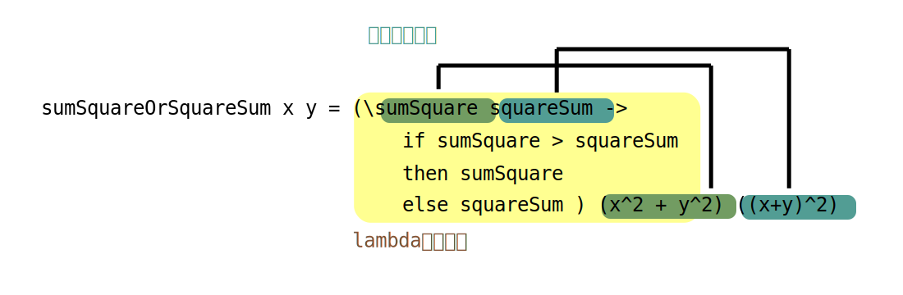
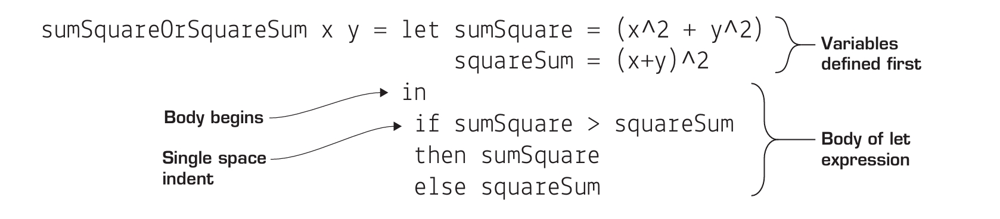

# Lambda 函数与语法作用域

学习了第3课,你将能够:

- 在 Haskell 中使用lambda函数
- 用 lambda 函数作为临时函数定义
- 理解语法作用域
- 通过lambda函数创建语法作用域
 
继续我们的Haskell与函数式编程的旅程。这一课,我们学习函数式编程中最基本的概念之一:lambda函数. 从表面上看，lambda函数(没有名字的函数)太简单了，没什么意思。但是lambda函数提供了令人难以置信的理论优势，同时也在现实世界中发挥了惊人的作用。

> **考虑这个**: 你在GHCi中瞎搞，想给三个值:4、10、22,快速计算其和的平方减去其平方之和的差。你可以手写出来:
> ```
> GHCi> (4 + 10 + 22)^2 - (4^2 + 10^2 + 22^2)
> ```
> 但这个表达式太绕了,容易出现拼写错误。此外，如果您想从GHCi命令历史中编辑此项目，则很难更改这些值(在GHCi中按向上箭头以获得前一个项目)。有没有一种方法可以在不显式定义函数的情况下使其更简洁?

## Lambda 函数

函数式编程中一个最基本的概念就是 _没有名字的函数_ ，称为**lambda函数**(由此有lambda演算 (calculus))。Lambda函数通常使用小写的希腊字母\\(λ\\)来表示。lambda函数的另一个常见名称是**匿名函数**(anonymous function)。你可以使用lambda函数重新定义第2课中的简单函数，只是没有名称。要做到这一点，可以使用Haskell的lambda语法，如图所示。


Lambda函数是最小可能的函数:它们接受一个值并返回一个值，仅此而已。你不能将刚才编写的这个匿名函数粘贴到GHCi或Haskell程序中，因为它本身只是一个表达式，什么都不会做。为了赋予lambda函数生命，你必须使用它。最简单的用法就是给它传递一个参数:

```
GHCi> (\x -> x) 4
4
25
GHCi> (\x -> x) "hi"
hi
GHCi> (\x -> x) [1,2,3]
[1,2,3]
```
注意，每次使用lambda表达式时，都必须重新定义它。这是有道理的，因为你没有名字来称呼它! Lambda函数是有用，但其设计的目的只是为了在很短的时间发挥功能。一般来说，如果具名函数可以完成这项工作，那么最好使用具名函数。

> 小测: 写一个lambda函数,它将自己的参数乘以2.向其传入一些参数来使用它.
> <details><summary>答案</summary><pre><code class="language-haskell">GHCi> (\x -> x*2) 2
> 4
> GHCi> (\x -> x*2) 4
> 8
></code></pre></details>

## 编写你自己的where子句

函数式编程中反复出现的一个主题是，如果你想从头开始，几乎没有什么东西是无法构建的。因此，等你熟悉函数式编程后，你就会对程序的工作方式有深刻的理解。为了演示lambda函数的强大所在，我们做一个实验，丢掉Haskell的`where`子句，看看能否从零把它造出来。你得知道这是什么意思,到目前为止，在函数中，你知道的唯一存储变量的地点就是`where`结构。

事实证明，lambda函数本身足以从无到有地创建变量。首先，我们来看一个使用`where`语句的函数。对于这个函数，你将接受两个数字，并返回其中较大的一个:它们的平方和`(x^2 + y^2)`或它们的平方和`((x + y)^2)`。这是我们使用`where`的版本。
 
```haskell
sumSquareOrSquareSum x y = if sumSquare > squareSum
                           then sumSquare
                           else squareSum
  where sumSquare = x^2 + y^2 
        squareSum = (x+y)^2
```

在`sumSquareOrSquareSum`中，`where`让代码更易于阅读并减少计算量(不过，从技术上讲，Haskell可以消除许多重复的函数调用，即使没有变量)。如果没有`where`，你可以直接替换变量，但这样会导致计算量加倍，代码也很难看，如下所示:

```haskell
sumSquareOrSquareSum x y = if (x^2 + y^2) > ((x+y)^2)
                           then (x^2 + y^2)
                           else (x+y)^2
```
你的函数是相对简单的，但没有`where`和变量定义，它看着真丑.没有变量的一个替代方案是将函数分成两步。从一个名为`body`的函数开始处理`sumSquareOrSquareSum`的主要比较部分，然后新创建的`sumSquareOrSquareSum`可以计算`sumSquare和squareSum`，并将它们传递给`body`。`body`的代码如下:

```haskell
body sumSquare squareSum = if sumSquare > squareSum
                           then sumSquare
                           else squareSum
```
然后`sumSquareOrSquareSum`计算`sumSquare`和`squareSum`，并将它们传递给`body`:
```haskell
sumSquareOrSquareSum x y = body (x^2 + y^2) ((x+y)^2)
```
能用，但真的很繁琐，你需要定义一个新的中间函数`body`。这个函数太简单了,以至于有点不配写一个中间步骤。那么不过你不想给这个中间函数命名,怎么办?写成lambda不就行了!首先来看一下lambda版本的`body`: 

```haskell
body = (\sumSquare squareSum -> 
          if sumSquare > squareSum
          then sumSquare
          else squareSum)
```
现在，如果你用这个lambda函数代替前面定义的`sumSquareOrSquareSum`中的`body`，就会得到这个表达式:



这仍然没有`where`子句漂亮(这也是Haskell内置提供`where`子句的原因)，但比之前的要好得多。更重要的是，你已经实现了变量的思想!

> 小测: 类似地替换这个函数中的`where`:
> ```haskell
> doubleDouble x = dubs*2
>   where dubs = x*2
> ```
> <details><summary>答案</summmary><p><code>doubleDouble x = (\dubs -> dubs*2) (x*2)
</code></details>


## 从 lambda 到 let: 制作你自己的可变变量

虽然lambda函数比原来的where函数更混乱，但它也更强大!where语句让一切都更容易理解，但它也在语法上封装在函数中。不能单独从函数中抽出来。lambda表达式则不是这样。你把它贴在合适的地方，也可以很容易地把它拉出来。你的lambda函数是一个表达式，一个独立的代码块。

Haskell还有一种`where`子句的替代品,`let`表达式。`let`表达式可以让你将`where`子句的可读性和`lambda`函数的强大功能结合起来。下图展示了使用let的sumSquareOrSquareSum函数。

<!-- TODO: 中文图解 -->


在Haskell中，选择`let`还是`where`主要是风格问题。在这一点上，应该很清楚，lambda函数本身可以非常强大:你可以用它覆盖变量! 在这个例子中，为了可读性，我们将使用`let`表达式而不是原始的lambda表达式。在函数式编程中，故意重写一个变量几乎没有意义，但为了证明这是可以做到的，下面的代码展示了一个`overwrite`函数，它接受一个变量`x`，然后把它的值重写三次:

```haskell
overwrite x = let x = 2
              in 
                let x = 3
                in
                  let x = 4
                  in 
                     x
```
这函数本身没什么用,但是它也许能提醒你GHCi中重定义变量的方式:

```
GHCi> let x = 2
GHCi> x
2
GHCi> let x = 3
GHCi> x
3
```
`overwrite`函数启发你,GHCi如何允许你重新定义变量，而仍然不会“作弊”地违反函数式编程规则。

> 小测: 用lambda重写`overwrite`函数
>
> <details><summary>答案</summary><pre><code>overwrite x = (\x -> 
>                (\x ->
>                 (\x -> x) 4
>                )3
>               )2
></code></pre></details>

现在明白了吧。如果你愿意，可以使用未命名函数来重新定义变量，就像在任何其他编程语言中一样。

> 译注: 那么这是怎么做到的? 每次开启一个lambda的时候,这个lambda就构成了一个新的作用域,在这个作用域内,x是以作为参数传过来的值.因此这种做法说不上修改变量的值,而是在每个作用域创建了一个新的值,只是它们恰好有同一个名字, _里面的名字把外面的名字盖住了_.

