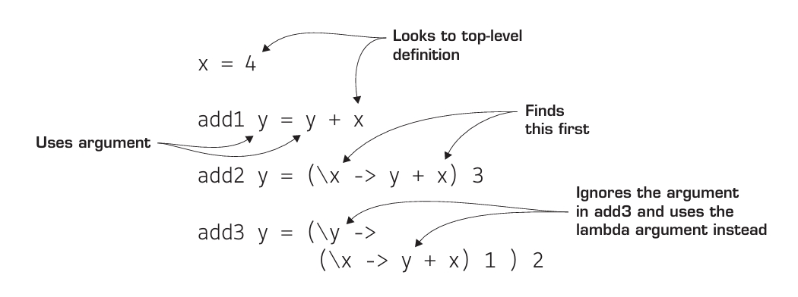

# Lambda 函数与语法作用域

学习了第3课,你将能够:

- 在 Haskell 中使用lambda函数
- 用 lambda 函数作为临时函数定义
- 理解语法作用域
- 通过lambda函数创建语法作用域
 
继续我们的Haskell与函数式编程的旅程。这一课,我们学习函数式编程中最基本的概念之一:lambda函数. 从表面上看，lambda函数(没有名字的函数)太简单了，没什么意思。但是lambda函数提供了令人难以置信的理论优势，同时也在现实世界中发挥了惊人的作用。

> **考虑这个**: 你在GHCi中瞎搞，想给三个值:4、10、22,快速计算其和的平方减去其平方之和的差。你可以手写出来:
> ```
> GHCi> (4 + 10 + 22)^2 - (4^2 + 10^2 + 22^2)
> ```
> 但这个表达式太绕了,容易出现拼写错误。此外，如果您想从GHCi命令历史中编辑此项目，则很难更改这些值(在GHCi中按向上箭头以获得前一个项目)。有没有一种方法可以在不显式定义函数的情况下使其更简洁?

## Lambda 函数

函数式编程中一个最基本的概念就是 _没有名字的函数_ ，称为**lambda函数**(由此有lambda演算 (calculus))。Lambda函数通常使用小写的希腊字母\\(λ\\)来表示。lambda函数的另一个常见名称是**匿名函数**(anonymous function)。你可以使用lambda函数重新定义第2课中的简单函数，只是没有名称。要做到这一点，可以使用Haskell的lambda语法，如图所示。


Lambda函数是最小可能的函数:它们接受一个值并返回一个值，仅此而已。你不能将刚才编写的这个匿名函数粘贴到GHCi或Haskell程序中，因为它本身只是一个表达式，什么都不会做。为了赋予lambda函数生命，你必须使用它。最简单的用法就是给它传递一个参数:

```
GHCi> (\x -> x) 4
4
25
GHCi> (\x -> x) "hi"
hi
GHCi> (\x -> x) [1,2,3]
[1,2,3]
```
注意，每次使用lambda表达式时，都必须重新定义它。这是有道理的，因为你没有名字来称呼它! Lambda函数是有用，但其设计的目的只是为了在很短的时间发挥功能。一般来说，如果具名函数可以完成这项工作，那么最好使用具名函数。

> 小测: 写一个lambda函数,它将自己的参数乘以2.向其传入一些参数来使用它.
> <details><summary>答案</summary><pre><code class="language-haskell">GHCi> (\x -> x*2) 2
> 4
> GHCi> (\x -> x*2) 4
> 8
></code></pre></details>

## 编写你自己的where子句

函数式编程中反复出现的一个主题是，如果你想从头开始，几乎没有什么东西是无法构建的。因此，等你熟悉函数式编程后，你就会对程序的工作方式有深刻的理解。为了演示lambda函数的强大所在，我们做一个实验，丢掉Haskell的`where`子句，看看能否从零把它造出来。你得知道这是什么意思,到目前为止，在函数中，你知道的唯一存储变量的地点就是`where`结构。

事实证明，lambda函数本身足以从无到有地创建变量。首先，我们来看一个使用`where`语句的函数。对于这个函数，你将接受两个数字，并返回其中较大的一个:它们的平方和`(x^2 + y^2)`或它们的平方和`((x + y)^2)`。这是我们使用`where`的版本。
 
```haskell
sumSquareOrSquareSum x y = if sumSquare > squareSum
                           then sumSquare
                           else squareSum
  where sumSquare = x^2 + y^2 
        squareSum = (x+y)^2
```

在`sumSquareOrSquareSum`中，`where`让代码更易于阅读并减少计算量(不过，从技术上讲，Haskell可以消除许多重复的函数调用，即使没有变量)。如果没有`where`，你可以直接替换变量，但这样会导致计算量加倍，代码也很难看，如下所示:

```haskell
sumSquareOrSquareSum x y = if (x^2 + y^2) > ((x+y)^2)
                           then (x^2 + y^2)
                           else (x+y)^2
```
你的函数是相对简单的，但没有`where`和变量定义，它看着真丑.没有变量的一个替代方案是将函数分成两步。从一个名为`body`的函数开始处理`sumSquareOrSquareSum`的主要比较部分，然后新创建的`sumSquareOrSquareSum`可以计算`sumSquare和squareSum`，并将它们传递给`body`。`body`的代码如下:

```haskell
body sumSquare squareSum = if sumSquare > squareSum
                           then sumSquare
                           else squareSum
```
然后`sumSquareOrSquareSum`计算`sumSquare`和`squareSum`，并将它们传递给`body`:
```haskell
sumSquareOrSquareSum x y = body (x^2 + y^2) ((x+y)^2)
```
能用，但真的很繁琐，你需要定义一个新的中间函数`body`。这个函数太简单了,以至于有点不配写一个中间步骤。那么不过你不想给这个中间函数命名,怎么办?写成lambda不就行了!首先来看一下lambda版本的`body`: 

```haskell
body = (\sumSquare squareSum -> 
          if sumSquare > squareSum
          then sumSquare
          else squareSum)
```
现在，如果你用这个lambda函数代替前面定义的`sumSquareOrSquareSum`中的`body`，就会得到这个表达式:


这仍然没有`where`子句漂亮(这也是Haskell内置提供`where`子句的原因)，但比之前的要好得多。更重要的是，你已经实现了变量的思想!

> 小测: 类似地替换这个函数中的`where`:
> ```haskell
> doubleDouble x = dubs*2
>   where dubs = x*2
> ```
> <details><summary>答案</summmary><p><code>doubleDouble x = (\dubs -> dubs*2) (x*2)
</code></details>


## 从 lambda 到 let: 制作你自己的可变变量

虽然lambda函数比原来的where函数更混乱，但它也更强大!where语句让一切都更容易理解，但它也在语法上封装在函数中。不能单独从函数中抽出来。lambda表达式则不是这样。你把它贴在合适的地方，也可以很容易地把它拉出来。你的lambda函数是一个表达式，一个独立的代码块。

Haskell还有一种`where`子句的替代品,`let`表达式。`let`表达式可以让你将`where`子句的可读性和`lambda`函数的强大功能结合起来。下图展示了使用let的sumSquareOrSquareSum函数。

<!-- TODO: 中文图解 -->


在Haskell中，选择`let`还是`where`主要是风格问题。在这一点上，应该很清楚，lambda函数本身可以非常强大:你可以用它覆盖变量! 在这个例子中，为了可读性，我们将使用`let`表达式而不是原始的lambda表达式。在函数式编程中，故意重写一个变量几乎没有意义，但为了证明这是可以做到的，下面的代码展示了一个`overwrite`函数，它接受一个变量`x`，然后把它的值重写三次:

```haskell
overwrite x = let x = 2
              in 
                let x = 3
                in
                  let x = 4
                  in 
                     x
```
这函数本身没什么用,但是它也许能提醒你GHCi中重定义变量的方式:

```
GHCi> let x = 2
GHCi> x
2
GHCi> let x = 3
GHCi> x
3
```
`overwrite`函数启发你,GHCi如何允许你重新定义变量，而仍然不会“作弊”地违反函数式编程规则。

> 小测: 用lambda重写`overwrite`函数
>
> <details><summary>答案</summary><pre><code>overwrite x = (\x -> 
>                (\x ->
>                 (\x -> x) 4
>                )3
>               )2
></code></pre></details>

现在明白了吧。如果你愿意，可以使用未命名函数来重新定义变量，就像在任何其他编程语言中一样。

> 译注: 那么这是怎么做到的? 每次开启一个lambda的时候,这个lambda就构成了一个新的作用域,在这个作用域内,x是以作为参数传过来的值.因此这种做法说不上修改变量的值,而是在每个作用域创建了一个新的值,只是它们恰好有同一个名字, _里面的名字把外面的名字盖住了_.

## 实践中的 lambda 函数与作用域

这些使用 lambda实现 `let`和`where`函数的例子乍一看似乎很做作，但它们却是JavaScript中一个最重要的设计模式的基础。JavaScript对lambda函数有强大的支持;在JavaScript中与`\x -> x `等价的代码如下所示:

```javascript
(x) => x
//一种古老的写法,那时还没有lambda字面函数
function(x){
    return x;
}
```

最初，JavaScript的设计目的只是为网站添加一点动作而已。可是人们非要拿它做大型项目,结果,其不幸的设计缺陷使得大型、复杂的代码库难以管理。最大的缺陷之一是JavaScript没有名称空间或模块的实现。如果你需要在代码中定义一个`length`函数，你最好希望你没有不小心覆盖在你正在使用的许多其他库中编写的另一个`length`函数。最重要的是，JavaScript使得意外声明全局变量变得非常容易。为了演示这一点，我们将从函数`libraryAdd`开始，比如它存在于第三方库中:

```js
var libraryAdd = function(a,b){
    c = a + b; //← 啊这,你忘了var关键词了
    return c;  //  结果不小心创建了一个全局变量
}
```
> 译注: 现在这么写js已经可以被同事打死了,js曾经使用古老而奇特的方式实现模块和语法作用域(马上就会讲到),现在(es6)它已经有正式的模块和let支持,甚至有了严格模式(`'use strict'`)来避免错误.写程序时,我们应当使用新的语法,但是在学习时,应当记住,js有这段历史.

这个简单的函数有一个巨大的问题:变量c被不小心声明为全局变量!这有多危险?看看这个例子就明白了:

```js
var a = 2;
var b = 3;
var c = a + b;             //这个函数偷偷地修改了外部变量c
var d = libraryAdd(10,20); //可是你完全不知道

console.log(c); //你以为它是5吗,它变成30了!
```
你所做的一切都是正确的，但在调用`libraryAdd`之后，变量`c`现在是30!这是因为JavaScript中没有命名空间，所以当`libraryAdd`给c赋值时，它会一直寻找，直到找到一个值或创建一个新的全局变量。不幸的是，它还真找到`var c`了。除非你深入研究别人的JavaScript代码，否则永远无法找出这个bug!

为了解决这个问题，JavaScript开发人员使用了lambda函数。通过将代码包装在lambda函数中，然后立即调用该函数，可以保证代码的安全。这种模式称为 _立即调用函数表达式_ (immediately invoked function expression, IIFE)。使用IIFE后，你的代码现在看起来像这样:

```js
(function(){ //制作一个lambda函数
    var a = 2;
    var b = 3;
    var c = a + b;
    var d = libraryAdd(10,20); // 现在这个危险的函数不会伤害你了
    console.log(c);//c是正确的值: 5
})()
```

有解决方案真是太好了!IIFE的工作原理与替换where语句的例子完全相同。每当创建一个新函数时，无论是否命名，都创建了一个新的作用域，也就是 _定义变量的环境_ 。使用变量时，程序会查看最近的作用域;如果变量的定义不存在，就跳转到上面的下一个。这种特殊类型的变量查找称为**词法作用域**(lexical scope)。Haskell和JavaScript都使用词法作用域，也证实因此IIFE和lambda函数变量的行为方式类似。下图展示了一个变量定义和三个函数定义，它们使用词法作用域来改变它们的值。

<!-- TODO: 中文 -->

你可以看到用相同的参数调用这三个函数时，结果有多么不同:

```
GHCi> add1 1
5
GHCi> add2 1
4
GHCi> add3 1
3
```

动态创建作用域是匿名函数的基本作用，以此lambda函数完成更强大的功能，第5课会详细介绍.

## 总结

这一课你学到了lambda函数。Lambda函数是一个很简单的概念:一个没有名字的函数。但它们是函数式编程的基础。除了作为函数式编程的理论储备，它们还提供了实际的好处。最明显的好处是，lambda函数允许你轻松地在运行中编写函数。lambda函数更强大的特性是根据需要创建作用域。接下来做一些测试吧.

**Q3.1** 练习编写lambda函数，将第3课中的每个函数都以lambda表达式重写一遍。

**Q3.2** 使用let表达式和lambda函数在本质上并不是一回事。例如，如果运行下面的代码，就会导致错误:

```haskell
counter x = let x = x + 1
            in 
              let x = x + 1
              in 
                 x
```

为了证明let和lambda功能并非完全相同，请重写这个计数器函数，但是以嵌套lambda代替let。(提示:从结尾开始。)

