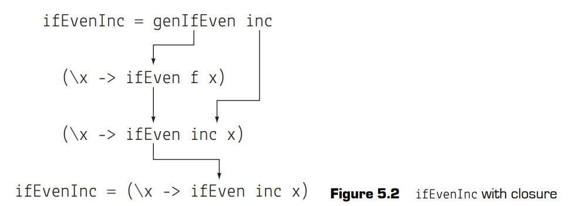

# 闭包和部分应用


学习了第5课,你将能够:


- 在lambda表达式中捕获值
- 使用闭包创建新函数
- 通过部分应用简化此过程

这一课介绍函数式编程的最后一个关键元素:闭包。**闭包**是使用lambda函数和一等函数的必然结果。通过组合这些lambda函数和一等函数来创建闭包，你可以动态地创建函数。事实证明，这是一个非常强大的抽象，尽管是最需要花时间习惯的。Haskell允许创建部分应用闭包，这让闭包的使用变得更加容易。本课结束时，您将了解部分应用如何使原本令人困惑的闭包更容易使用。


Consider this :In the preceding lesson, you learned how to pass in programming logic
to other functions because of first-class functions. For example, you might have a getPrice function that takes a URL and a website-specific price-extraction function:

getPrice amazonExtractor url

Although this is useful, what happens if you need to extract items from 1,000 URLs, but
all using amazonExtractor? Is there a way to capture this argument on the fly so you have
to pass in only the url parameter for future calls?


> **考虑这个**:在前一课中，我们学习了如何利用一等函数将编程逻辑传递给其他函数。例如，你可能有一个`getPrice`函数，它接受一个URL和一个特定于网站的价格提取函数:
> ```haskell
> getPrice amazonExtractor url
> ```
> 虽然这很有用，但如果你需要从1000个url中提取条目，而且都使用`amazonExtractor`，该怎么办?有没有一种方法可以在运行时捕获此参数，以便在以后调用时只需传递url参数?


## 闭包: 用函数创造函数

在第4课中，我们定义了一个名为`ifEven`的函数(代码清单4 - 3)。通过使用函数作为`ifEven`的参数，我们可以抽象出一种计算模式。然后，我们创建了函数`ifEvenInc`、`ifEvenDouble`和`ifEvenSquare`。

```haskell
ifEvenInc n = ifEven inc n
ifEvenDouble n = ifEven double n
ifEvenSquare n = ifEven square n
```
ifEvenInc n = ifEven inc n ifEvenDouble n = ifEven double n ifEvenSquare n = ifEven square n

使用函数作为参数有助于代码整洁。但你会注意到你仍然在重复一个编程模式!除了传递给`ifEven`的函数之外，这些定义都是相同的。你想要的是一个构建`ifEvenX`函数的函数。为了解决这个问题，你可以构建一个返回函数的新函数，名为`genIfEven`。


你传入一个函数并返回一个lambda函数。你传入的函数`f`会被lambda函数捕获!当你在lambda函数中捕获一个值时，这被称为**闭包**。

这个小示例值得仔细分析,到底发生了什么。为了更好地理解这一点，让我们看看如何使用`genIfEven`来创建`ifEvenInc`函数，如图。



现在，让我们继续看一个真实的例子，它使用闭包来帮助构建搭配API使用的URL。

> 小测: 编写一个函数`genIfXEven`，它创建一个包含`x`的闭包，并返回一个新函数，当x为偶数时，用户可以传入一个函数应用到`x`上
> <details><summary>答案</summary><pre><code class='language-haskell'>ifEven f x = if even x
>   then f x
>   else x
>genIfXEven x = (\f -> ifEven f x)
></code></pre></details>
 

## 示例: 为 API 创建 URL
获取数据最常见的方法之一是使用HTTP请求调用RESTful API。最简单的请求类型是GET请求，需要发送到另一个服务器的所有参数都在URL中编码。在这个例子中，每个请求需要的数据如下所示:

- 域名
- 所请求的资源类型
- 资源ID
- API 密钥

这是一个可能的URL.


从各部分构建URL的方法很直白了.这是你的构建函数 `getRequestURL`.

```haskell
getRequestURL host apiKey resource id = host ++
                                        "/" ++
                                        resource ++
                                        "/" ++ 
                                        id ++
                                        "?token=" ++
                                        apiKey
```
这个函数有一点可能会让你感到奇怪:参数的顺序与使用它们的顺序不一样，或者它们在URL中出现的顺序也不一样。_当你想要使用闭包时(在Haskell中几乎任何时候都可以使用)，你需要将参数按照从最一般到最具体的顺序排列。_ 在这种情况下，每个主机可以有多个API密钥，每个API密钥将使用不同的资源，每个资源将有许多与之关联的id。定义`ifEven`时也是如此;你传递的函数将处理很大范围的输入，因此它更通用，应该出现在参数列表的第一个。

现在你已经有了生成请求的基本函数，你可以看看它是如何工作的:

```
GHCi> getRequestURL "http://example.com" "1337hAsk3ll" "book" "1234"
"http://example.com/book/1234?token=1337hAsk3ll"
```
太棒了!这是一个很好的通用解决方案，因为您的团队作为一个整体将查询许多主机，所以不太具体反而有用。团队中几乎每个程序员都将专注于来自少数主机的数据。让程序员每次需要发出请求时都手动输入http://example.com，这很蠢，还容易出错。你需要的是一个函数，每个人都可以使用它来为他们生成一个请求URL构建器。这个问题的答案是闭包。生成器看起来如图5 - 4所示:


```haskell
exampleUrlBuilder = genHostRequestBuilder "http://example.com"
```
当传入值example.com时，这个函数就创建了一个新的、未命名的函数来捕获主机，并且只需要剩下的三个参数。在定义`exampleUrlBuilder`时，需要给匿名函数指定一个名字。任何时候，只要你有一个想要向其发出请求的新URL，都能简单地为此创建一个自定义函数。将这个函数加载到GHCi中，看看它是如何简化代码的:

```
GHCi> exampleUrlBuilder "1337hAsk3ll" "book" "1234"
"http://example.com/book/1234?token=1337hAsk3ll"
```
很明显，当你考察`apiKey`时，会再次遇到相同的问题。每次调用`exampleUrlBuilder`时都传入`apiKey`仍然很繁琐，因为你可能只会使用一两个API密钥。当然，你可以再来一个闭包来修复这个问题! 这一次，你就要将`exampleUrlBuilder`函数和`apiKey`都传递给生成器。


```haskell
genApiRequestBuilder hostBuilder apiKey = (\resource id ->
    hostBuilder apiKey resource id)
```

注意一下，这个函数既有作为参数的函数,又有作为返回值的函数。在闭包中有你需要的特定函数的副本，以及你需要捕获的API密钥。最后，你构建出一个函数，让创建请求URL变得更容易。

```haskell
myExampleUrlBuilder = genApiRequestBuilder exampleUrlBuilder "1337hAsk3ll"
```
然后你可以以此快速地为不同的 resource/ID 选项创建URL:
```
GHCi> myExampleUrlBuilder "book" "1234"
"http://example.com/book/1234?token=1337hAsk3ll"
```
> 小测: 写`genApiRequestBuilder` 的另一个版本,使其把资源名称也当做参数.
> <details><summary>答案</summary><pre><code class='language-haskell'>genApiRequestBuilder hostBuilder apiKey resource = (\id ->
>                                                     hostBuilder apiKey
>                                                     resource id)
></code></pre></details>

## 部分应用: 简化闭包的使用

闭包强大而有用。但是使用lambda函数来创建闭包会使其难以阅读和推理。此外，到目前为止编写的所有闭包都遵循几乎相同的模式:提供函数接受的一些参数，然后创建一个新函数，等待其他参数传入。假设你有一个函数`add4`，它接受四个变量并将它们相加:
```haskell
add4 a b c d = a + b + c + d
```
现在你要创建一个新函数 `addXto3`,它接受一个`x`,返回一个闭包,其等待后续三个参数的传入:
```haskell
addXto3 x = (\b c d ->
              add4 x b c d)
```

很难看出这个显式的lambda表达式要干什么。况且你要是想创建`addXYto2`呢?

```haskell
addXYto2 x y = (\c d ->
                 add4 x y c d)
```
有四个参数需要手动管理，即使是这个平凡的函数都看起来复杂。Lambda功能强是强，但写起来太难看了.

为此Haskell准备了一个有趣的特性。如果调用add4时传入的参数少于4个，会发生什么?答案似乎很明显:它应该抛出一个错误。可这不是Haskell所做的。你可以使用`add4`和一个参数在GHCi中定义一个值`mystery`:

```
GHCi> mystery = add4 3
```
如果运行这段代码，你会发现它不会导致错误。Haskell为你创建了一个全新的函数:

```
GHCi> mystery 2 3 4
12
GHCi> mystery 5 6 7
21
```

这个神秘函数将剩下的3个参数和刚才的3相加。当你在Haskell中调用任何一个函数时，如果参数数量少于要求的数量，你会得到一个等待剩余参数的新函数。这种语言特性称为**部分应用**。这个神秘函数与你编写`addXto3`并将参数3传递给它是一样的。部分应用不仅让你不必手动创建lambda函数，而且你甚至不需要定义`addXto3`这个奇怪的名字!类似地,你还可以轻松创建`addXYto2`:

```
GHCi> anotherMystery = add4 2 3
GHCi> anotherMystery 1 2
8
GHCi> anotherMystery 4 5
14
```

到目前为止，如果你觉得闭包使用起来令人困惑，那么你很幸运! 多亏了部分应用，你很少需要在Haskell中显式地编写或考虑阅读闭包。`genHostRequestBuilder`和`genApiRequestBuilder`的所有工作都是内置的，可以通过省略不需要的参数来达到。

```haskell
exampleUrlBuilder = getRequestUrl "http://example.com" 
myExampleUrlBuilder = exampleUrlBuilder "1337hAsk3ll"
```
在Haskell的某些情况下，你仍然需要使用lambda函数来创建闭包，但使用部分应用更为常见。以下部分应用的过程:


> 创建一个专门针对http://example.com、1337hAsk3ll API密钥和book资源的构建器函数。这个函数只需要指定图书的ID，然后生成完整的URL .
> <details><summary>答案</summary><pre><code class='language-haskell'>exampleBuilder = getRequestUrl "http://example.com" "1337hAsk3ll" "books"
></code></pre></details>

## 结合起来

部分应用也是我们创建参数从最一般到最不一般排序规则的原因。使用部分施用时，参数会先到后应用。可是第4课定义`addresletter`函数时却违反了这个规则:
```haskell
addressLetter name location = locationFunction name
  where locationFunction = getLocationFunction location
```

在`addresletter`中，`name`参数位于`location`参数之前。创建一个给定地区等待名字的函数`addressLetterNY`，比创建一个给全世界所有Bob Smiths写信的`addressLetterBobSmith`更合理。如果你使用的是其他库中的函数，可能不方便重写人家的函数，不过你可以创建一个对部分应用友好的版本来修复这个问题，如下所示。
```haskell
addressLetterV2 location name = addressLetter name location
```
对于临时修补`addresletter`函数的情况，这是个好办法。可是如果你继承了一整个代码库，其中的许多库函数在使用两个参数时都出现了同样的错误，该怎么办?最好能找到这个问题的通用解决方案，而不是写出每一种情况。结合目前学到的所有知识，它可以以一个简单的函数实现。你想创建一个名为`flipBinaryArgs`的函数，它接受一个函数，翻转其参数的顺序，然后原封不动地返回它。为此，你需要综合使用lambda函数、一等函数和闭包。这些可以放到一行Haskell代码中。


>译注: 这里如果你想进一步应用部分求值,你可以把`x`和`y`都写到前面参数上.
> ```haskell
> flipBinaryArgs f x y = f y x
> ```
> 事实上,标准库里有一个与`flipBinaryArgs`功能完全相同的函数`flip`,它就是这么定义的.

现在你可以使用`flipBinaryArgs`重写`addressLetterV2`，然后创建一个`addressLetterNY`:

```haskell
addressLetterV2 = flipBinaryArgs addressLetter
addressLetterNY = addressLetterV2 "ny"
```

在GHCi上测试:

```
GHCi> addressLetterNY ("Bob","Smith")
Bob Smith: PO Box 789 - New York, NY, 10013
```

你的`flipBinaryArgs`函数不仅仅是用于修复与我们的代码
泛方针代码不一致的函数。很多二元函数都有一个自然的顺序，例如除法.
Haskell中一个有用的技巧是，任何中缀运算符(例如`+`、`/`、`-`、`*`)都可以作为前缀函数，只要在它周围加上一对括号:

```
GHCi> 2 + 3
5
GHCi> (+) 2 3
5
GHCi> 10 / 2
5.0
GHCi> (/) 10 2
5.0
```
在除法和减法中，参数的顺序很重要。尽管参数有一个自然的顺序，但也有可能你可能想要围绕第二个参数创建一个闭包。这时，你可以使用`flipBinaryArgs`。因为`flipBinaryArgs`是一个非常有用的函数，所以有一个名为`flip`的现有函数，它的行为与`flipBinaryArgs`相同。

> 译注: 实际上这时候往往会用部分表达式. 
> - `(/ 2)` 
> - `(flip (/) 2)` 
> - `\former -> former / 2` 
> 
> 的效果是相同的.但是第一个最省事.


> 小测: 使用`flip`和部分应用创建一个名为`subtract2`的函数，它从传入的任何数字中删除2。 
> <details><summary>答案</summary><code class='language-haskell'>substract2 = flip (-) 2
></code></details>

## 总结

这一课，你学到了函数式编程中的重要思想: 闭包。有了lambda函数、一等函数和闭包，你就拥有了进行函数式编程所需的一切。闭包结合了lambda函数和一等函数，为你提供了强大的功能。有了闭包，你可以轻松地在运行中创建新函数。我们还学习了部分应用如何简化闭包的使用。习惯了部分应用后，你可能有时会忘记你正在使用的是闭包!现在来做两个练习吧。

**Q 5.1** 现在你学了部分应用,你就不再需要定义 `genIfEvenX`了. 
使用`ifEven`和部分应用来重构 `ifEvenInc`, `ifEvenDouble`, `ifEvenSquare`.

**Q 5.2**
即使Haskell没有部分应用，你也可以强行整出一些近似的功能。遵循与`flipBinaryArgs`类似的模式，编写一个函数`binaryPartialApplication`，它接受一个二元函数和一个参数，并返回一个等待缺失参数的新函数。
