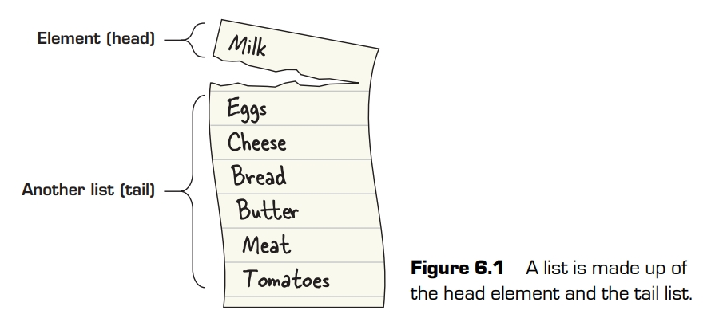

# 列表

学习了第6课,你将能够:

- 理解构成列表的元素
- 学习构建列表
- 理解函数式编程中列表的角色
- 使用常见的列表函数
- 学习惰性求值的基础

从很多方面来说，数组都是C语言编程的基本数据结构。如果你正确理解了C语言中的数组，你就必须理解内存分配是如何工作的，数据如何存储在计算机上，以及指针和指针算术的基础知识。Haskell(和一般的函数式编程)的基本数据结构是列表。即使你在本书中学习一些更高级的主题，如functor和monad，简单的列表仍然是最有用的例子。这一课将适当地介绍这个非常重要的数据结构。你将学习将列表拆分和合并的基础知识，以及Haskell提供的列表的一些基本函数。最后，介绍Haskell的另一个独特特性:惰性求值。惰性求值非常强大，它允许你表示和处理无限长的列表!当你在Haskell中遇到某个问题时，回头看看列表是否能给你一些启发，这几乎总是用得上。


>**考虑这个** 你为一家有10,000名员工的公司工作，其中一些人想在下班后参加垒球队。该公司有五个以颜色命名的团队，你希望将员工分配到这些队伍:
> ```haskell
> teams = ["red","yellow","orange","blue","purple"]
> ```
> 您有一个员工列表，您希望将他们均匀地匹配到正确的团队.有没有一种简单的方法使用Haskell列表函数完成这个任务吗?

## 列表的结构

列表是函数式编程中最重要的数据结构。其中一个关键原因是列表本身就是递归的。列表要么是一个空列表，要么是一个元素后面跟着另一个列表。分解和构建列表是函数式编程中许多技术的基本工具。

在分解列表时，主要方法是是头(`head`)、余下(`tail`)和尾(用`[]`表示)。`head`只是列表中的第一个元素:

```
GHCi> head [1,2,3]
1
GHCi> head [[1,2],[3,4],[5,6]]
[1,2]
```
`tail`只是代表列表在头之后余下的元素:
```
GHCi> tail [1,2,3]
[2,3]
GHCi> tail [3]
[]
```

只有一个元素的列表的尾部是`[]`，表示列表结束。列表的末尾只是一个空列表。但空列表不同于其他列表，因为它既没有头也没有尾。在`[]`上调用`head`或`tail`将导致错误。看一下表头和表尾，就会发现列表的递归性质:表头是一个元素，表尾是另一个列表。可以把这一过程可视化。



你可以把列表拆成小块，但如果你不能再把它们拼起来，这也没什么用!在函数式编程中，建立列表和分解列表一样重要。要构建一个列表，只需要一个函数`cons`和作为同义词的中缀运算符`(:)`。这个术语是construct的缩写，起源于Lisp。我们把这个操作称为consing，因为`:`在句子中看起来有点奇怪。

要创建列表，需要将一个值与另一个列表进行连接。创建列表的最简单方法是使用空列表构造一个值:

```
GHCi> 1:[]
[1]
```
在底层，Haskell中的所有列表都实现为系列consing操作，而`[...]`表示法不过是一种语法糖(编程语言语法的一种特性，旨在使代码更易于阅读):

```
GHCi> 1:2:3:4:[]
[1,2,3,4]
GHCi> (1,2):(3,4):(5,6):[]
[(1,2),(3,4),(5,6)]
```

注意，所有这些列表都以空列表`[]`结尾。根据定义，列表总是一个值与另一个列表(也可以是空列表)合并。如果愿意，可以把一个值添加到现有列表的前面:

```
GHCi> 1:[2,3,4]
[1,2,3,4]
```
值得注意的是，到目前为止你看到的字符串本身都是字符列表的语法糖(单个字符用单引号而不是双引号表示):

```
GHCi>['h','e','l','l','o']
"hello"
GHCi> 'h':'e':'l':'l':'o':[]
"hello"
```
注意注意注意，在Haskell中，列表中的每个元素必须是相同的类型。例如，你可以将字母`'h'`与字符串`"ello"`拼接起来，因为`"ello"`只是一个字符列表，而`'h'`(单引号)是一个字符:

```
GHCi> 'h':"ello"
"hello"
```
但你不能将`"h"`(双引号)拼接到`"ello"`，因为`"h"`是一个字符列表，而`"ello"`中的**值**是单个字符。当你移除语法糖时，这就更加明显。

```haskell
"h":"ello" -- 错误!
['h']:['e','l','l','o']   -- 移除一层语法糖
'h':[]:'e':'l':'l':'o':[] -- 完全移除语法糖
```
如果你确实想合并两个列表，则需要使用`++`将它们连接起来。你在第3课中见过拼接文本，但鉴于字符串就是列表，`++`其实适用于任何列表:

```
GHCi> "h" ++ "ello"
"hello"
GHCi> [1] ++ [2,3,4]
[1,2,3,4]
```

列表的拼接和拆分在为列表编写递归函数时有根本性的重大作用。函数式编程中几乎所有的顺序操作都涉及构建列表、分解列表或二者结合。

## 列表与惰性求值

因为列表在Haskell中非常重要，所以有很多方法可以快速生成数据范围。下面是一些例子:

Because lists are so important in Haskell, there are many ways to quickly generate ranges of data. Here are some examples

```haskell
[1 .. 10] -- 从1到10的一系列值构成的列表 
[1,2,3,4,5,6,7,8,9,10]

[1,3 .. 10] -- 下一个值是3,即创建奇数
[1,3,5,7,9]

[1, 1.5 .. 5] -- 下一个值是1.5,即步长为0.5
[1.0,1.5,2.0,2.5,3.0,3.5,4.0,4.5,5.0] -- 注意元素的类型是 Double

[1,0 .. -10] -- 降序列表
[1,0,-1,-2,-3,-4,-5,-6,-7,-8,-9,-10]
```

有用的，但不特别出彩。许多编程语言都有以类似方式工作的`range`函数。可是,如果你忘了给值域设定上界会怎样?

```
GHCi> [1 .. ]
[1,2,3,4,5,6,7,8,9,10,11,12 ..
```

生成一个无尽列表!这很酷，但很快就会阻塞终端，似乎不是特别有用。有趣的是，你可以将这个列表赋值给一个变量，甚至在函数中使用它:

```haskell
simple x = x
longList = [1 .. ]
stillLongList = simple longList
```
令人震惊的是，这段代码正常通过编译了。你定义了一个无限列表，然后在函数中使用它。为什么Haskell没有在计算无限长的列表时绷住?**因为它没有完全求出这个列表**.Haskell使用一种特殊形式的求值，称为**惰性求值**。在惰性求值中，除非需要，否则不会对代码求值。在使用longList的情况下，不需要计算列表中的任何值。

惰性求值既有优点，也有缺点。很容易看出其中的一些优点。首先，计算上的好处是，任何不是绝对需要的代码都不会被计算。另一个好处是，你可以定义和使用有趣的结构，如无限列表。这对于很多实际问题都很有用。惰性求值的缺点不那么明显。最大的问题是很难推断代码的性能。在这个简单的例子中，很容易看出传递给`simple`的任何参数都不会被求值，但稍微复杂一点，这一点就不那么明显了。更大的问题是，你可以很容易成谱系地构建大量的未求值函数，而将这些函数的结果算出来,存储其结果比存储这一系列 _待求值代码(thunk)_ 成本要低得多。

> 小测: 判断, 你是否能编译运行一段程序,其中变量`backwardsInfinity = reverse [1..]`.
> <details><summary>答案</summary>
> 行. 即使你想翻转一个没有头的列表,如果你没有用到它,它就不会被求值.可是,如果你打开GHCi然后输入
> 
>  <code><pre>GHCi> backwardsInfinity</pre></code>
> 
> 那么你触动了对其的求值,这个求值过程就没有尽头了.
> </details>


